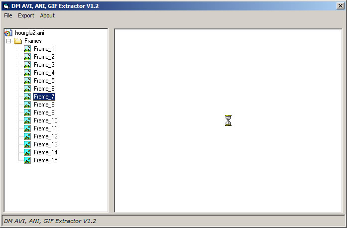



## DM AVI,ANI,GIF Frame Extractor

### Description

DM AVI Bitmap Decompiler Beta 1.2

New update to the project you can now extract avi files with 16 colors, 8 bit avi , 16,24 and 32 bit color, You can now export frames to TGA 16,24 and 32 color, Support for extracting frames form Animated cursors that can be saved as icons or cursors supports all color formats, Now added support to Extract frames form GIF Files, export frames as bmp,tga or extract the original frame as GIF, Loads of info added about each resource plus. hope you like the update please vote.
 
### More Info
 
Only supports Uncompressed AVI Files.

             |
---                |---
**Submitted On**   |2006-10-09 09:18:02
**By**             |[dreamvb](https://github.com/Planet-Source-Code/PSCIndex/blob/master/ByAuthor/dreamvb.md)
**Level**          |Beginner
**User Rating**    |5.0 (60 globes from 12 users)
**Compatibility**  |VB 5\.0, VB 6\.0
**Category**       |[Graphics](https://github.com/Planet-Source-Code/PSCIndex/blob/master/ByCategory/graphics__1-46.md)
**World**          |[Visual Basic](https://github.com/Planet-Source-Code/PSCIndex/blob/master/ByWorld/visual-basic.md)
**Archive File**   |[DM\_AVI\_ANI20251510162006\.zip](https://github.com/Planet-Source-Code/dreamvb-dm-avi-ani-gif-frame-extractor__1-66620/archive/master.zip)

